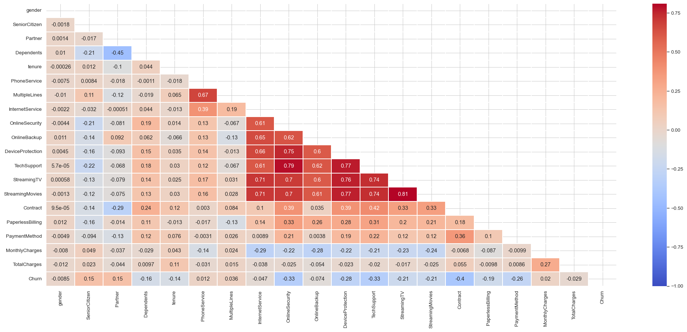

# Customer Churn Prediction Model

This repository contains a machine learning model for predicting customer churn based on various features from a telecom dataset.

## Table of Contents
- [Customer Churn Prediction Model](#customer-churn-prediction-model)
  - [Table of Contents](#table-of-contents)
  - [Introduction](#introduction)
  - [Dataset](#dataset)
  - [Features](#features)
  - [Preprocessing Steps](#preprocessing-steps)
  - [Model Pipeline](#model-pipeline)
  - [Results](#results)
    - [Accuracy Scores](#accuracy-scores)
    - [Classification Report](#classification-report)
      - [Overall Metrics](#overall-metrics)

## Introduction

This project aims to develop a predictive model for identifying customers at risk of churning from a telecom service provider. I'll use various machine learning techniques to analyze the impact of different factors on customer churn.

## Dataset

The dataset used is called 'Customer-Churn.csv'. It contains information about customer demographics, service usage, and billing details.

## Features

The main features considered in our analysis are:

- Demographic information
- Service usage metrics
- Billing details
- Contract type
- Payment method
- Internet service status

## Preprocessing Steps

1. Loaded the dataset using pandas
2. Dropped unnecessary columns
3. Handled missing values
4. Encoded categorical variables
5. One-hot encoded selected columns
6. Normalized numerical features
7. Performed correlation analysis
8. Selected top features based on importance using **RandomForestClassifier**
9. Used **Grid search** for finding the optiomal hyperparameters

After removing null data, I removed features that didn't affect the target and removed highly correlated features to get better results. I used Grid search for finding the optimal hyperparameters for SVC pipeline which uses LDA for dimensionality reduction.

## Model Pipeline

I implemented several machine learning models and compared their performance:

1. Linear Discriminant Analysis (LDA)
2. Support Vector Classifier (SVC)
3. Random Forest Classifier (RFC)
4. AdaBoost Classifier
5. XGBoost Classifier
6. Logistic Regression
7. K-Nearest Neighbors (KNN)
8. Decision Tree Classifier

## Results

| Model | Test Accuracy |
| ----- | ------------- |
| ADA   | 85.2%         |
| XGB   | 84.5%         |
| LR    | 83.1%         |
| SVC   | 82.5%         |
| KNN   | 81.9%         |
| RFC   | 81.5%         |
| DT    | 80.8%         |

### Accuracy Scores

I used Majority voting and Stacking classifier with cross_val_score to boost my performance. They both produced the same accuracy score of 81%.

### Classification Report

| Class | Precision | Recall | F1-Score | Support |
| ----- | --------- | ------ | -------- | ------- |
| 0     | 0.84      | 0.91   | 0.87     | 1549    |
| 1     | 0.68      | 0.52   | 0.59     | 561     |

#### Overall Metrics
- Accuracy: 0.81
- Total Samples: 2110

---
After using classification models, I attempted to use a Neural Network to achieve better results. I used PyTorch for my model, which consists of the following layers:

| Layer | Type        | Neurons |
| ----- | ----------- | ------- |
| fc1   | Dense       | 1024    |
| bn1   | BatchNorm1d | 1024    |
| fc2   | Dense       | 256     |
| bn2   | BatchNorm1d | 256     |
| fc3   | Dense       | 512     |
| bn3   | BatchNorm1d | 512     |
| fc4   | Dense       | 128     |
| bn4   | BatchNorm1d | 128     |
| fc5   | Dense       | 64      |
| bn5   | BatchNorm1d | 64      |
| out   | Dense       | 1       |

This architecture combines multiple dense layers with batch normalization and dropout for improved stability and generalization. The use of ReLU activation promotes non-linearity in the network, while the final linear layer outputs a single probability value for binary classification.

I trained my model on the GPU using CUDA and Binary Cross-Entropy Loss (BCE Loss). Therefore, I used a Sigmoid function at the output of the forward function. 
I used Adam as my optimizer and StepLR for learning rate decay. After training for 10 minutes, I achieved an **accuracy of 0.829**, which represents an improvement over previous models.

Then I used a more complex model and switched to BCEWithLogits as my loss funciton and ReduceLROnPlateau as my scheduler which I got around the same accuracy
